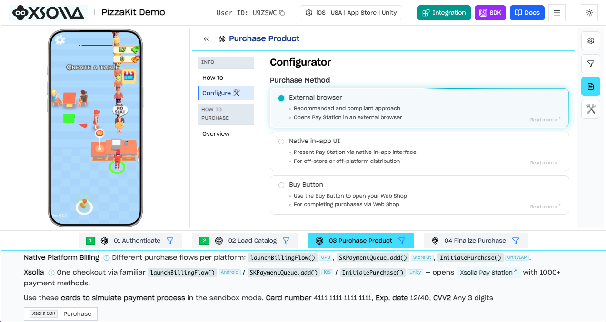

# Xsolla Mobile SDK for Windows

[](https://dotnet.microsoft.com/)
[](https://isocpp.org/)
[](LICENSE)

Pre-built native SDKs for integrating in-game payments into your Windows app via Xsolla Pay Station.

## SDK Explorer

See exactly how payments work before writing a single line of code. The SDK Explorer lets you walk through authentication, catalog loading, purchasing, and finalization — all in an interactive environment.

[](https://developers.xsolla.com/sdk/demo/)

[**Integrate Now →**](https://developers.xsolla.com/sdk/demo/)

## Essential Links

- [SDK Explorer](https://developers.xsolla.com/sdk/demo/) — interactive demo
- [SDK Documentation](https://developers.xsolla.com/sdk/) — full integration guide

## Overview

Xsolla Mobile SDK for Windows provides native C# and C++ libraries for in-game purchases via Xsolla Pay Station. Both SDKs share the same backend infrastructure and offer equivalent functionality.

**Key features:**

- 1000+ payment methods across 200+ geographies
- 130+ currencies including local and alternative payment methods
- Built-in anti-fraud protection
- 25+ languages supported out of the box
- Player authentication (Xsolla Login widget, social login, custom tokens)
- Product catalog and virtual items

## SDKs

| SDK | Platforms | Distribution |
|-----|-----------|-------------|
| **C# SDK** | .NET 6, 7, 8, 9 + .NET Standard 2.1 | `com.xsolla.sdk-csharp-{version}.zip` |
| **C++ SDK** | Windows x64 (MSVC) | `com.xsolla.sdk-cpp-{version}.zip` (coming soon) |

Download the latest release ZIP from [GitHub Releases](../../releases).

## C# SDK

### Requirements

- .NET 6.0 or later (or .NET Standard 2.1 compatible runtime)

### Installation

1. Download `com.xsolla.sdk-csharp-{version}.zip` from [Releases](../../releases)
2. Extract the ZIP — DLLs are organized by framework under `lib/`
3. Reference the `XsollaCSharpSDK.dll` matching your target framework

### Quick Start

#### 1. Configure and create the store client

```csharp
using Xsolla.SDK.Common;
using Xsolla.SDK.Store;

var settings = XsollaClientSettings.Builder.Create()
    .SetProjectId(YOUR_PROJECT_ID)
    .SetLoginId("YOUR_LOGIN_ID")
    .Build();

var configuration = XsollaClientConfiguration.Builder.Create()
    .SetSettings(settings)
    .SetSandbox(true)
    .Build();

var storeClient = XsollaStoreClient.Builder.Create()
    .SetConfiguration(configuration)
    .AddProducts(new[] { "booster_max_1", "key_1", "premium_3" })
    .SetOnRestore(OnPurchase)
    .Build();
```

#### 2. Initialize and fetch products

```csharp
storeClient.Initialize((products, error) =>
{
    if (error != null)
    {
        Console.WriteLine($"Init failed: {error.message}");
        return;
    }

    foreach (var product in products)
        Console.WriteLine($"{product.sku}: {product.formattedPrice}");
});
```

#### 3. Purchase a product

```csharp
storeClient.PurchaseProduct("key_1", (purchasedProduct, error) =>
{
    if (error != null)
    {
        Console.WriteLine($"Purchase failed: {error.message}");
        return;
    }

    // Validate the purchase
    storeClient.ValidatePurchase(purchasedProduct.ToReceipt(), (success, err) =>
    {
        if (success)
        {
            // Award the item, then consume
            storeClient.ConsumeProduct(
                purchasedProduct.sku,
                purchasedProduct.quantity,
                purchasedProduct.transactionId,
                consumeError => { /* handle */ });
        }
    });
});
```

## C++ SDK

Coming soon.

## License

[Apache License 2.0](LICENSE) — Copyright 2026 Xsolla Inc.
